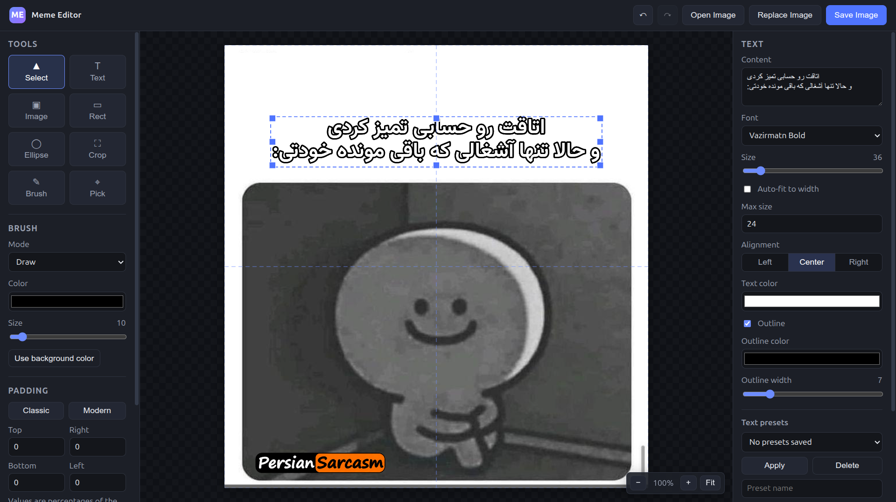

<p align="center">
  
</p>

<h1 align="center">Meme Editor</h1>

<p align="center">
  A fast, modern, offline meme editor. Load an image, add text, stickers, shapes and
  brush strokes, pad it like a classic meme, and export a PNG — all from a native
  desktop app for Windows and Linux.
</p>

<p align="center">
  <a href="https://github.com/TheFeij/MemeEditor/actions/workflows/release.yml">
    
  </a>
  <a href="https://github.com/TheFeij/MemeEditor/releases/latest">
    
  </a>
</p>

> [!NOTE]
> This project is **vibe coded** — it was built iteratively by prompting **DeepSeek V4 Flash** agent, and this
> README was written by **DeepSeek V4 Flash**. Expect pragmatic, working software
> rather than a hand-crafted, artisanal codebase.
>
> The original [`plan.md`](plan.md) — the initial design and implementation plan — was
> discussed and prepared with **GPT-5.6** in a chat on the [ChatGPT website](https://chatgpt.com/).

---

## Features

- **Image input** — open a file, drag & drop from your OS, or paste from the clipboard.
- **Image layers** — stack extra images (logos, stickers) on top of the base image and resize them.
- **Replace base image** — swap the underlying meme while keeping text, stickers and shapes in place.
- **Text tool** — content, font, size, alignment, color, and outline. Auto-fit and max-size options.
- **Text presets** — save, apply, rename and delete reusable text styles.
- **Shapes** — rectangles (with corner radius) and ellipses.
- **Brush** — freehand draw, or use cover/remove mode to paint over parts of an image with a color.
- **Eyedropper** — sample any color from the canvas.
- **Padding** — add percentage-based padding on each side, with Classic and Modern presets.
- **Background** — white, black, or any custom color.
- **Arrange** — bring forward / send backward, and delete selected objects.
- **Undo / redo** — full history of your edits.
- **Export** — save the composition as a PNG via a native save dialog, remembering the last folder you used.

## Download

Grab the latest prebuilt binary from the [Releases](https://github.com/TheFeij/MemeEditor/releases) page:

| Platform | File |
| --- | --- |
| Linux (amd64) | `MemeEditor-linux-amd64` |
| Windows (amd64) | `MemeEditor-windows-amd64.exe` |

On Linux you need `webkit2gtk`. The prebuilt binary is compiled with the
`webkit2_41` tag, so install `webkit2gtk-4.1` (e.g. `libwebkit2gtk-4.1-0` on Debian/Ubuntu).
On Windows the app uses the bundled WebView2 runtime (present by default on Windows 10/11).

## Build from source

### Prerequisites

- [Go](https://go.dev/) 1.24+
- [Wails CLI](https://wails.io/) v2.11.0: `go install github.com/wailsapp/wails/v2/cmd/wails@v2.11.0`
- `make` (optional, but recommended)

**Linux build deps** (Debian/Ubuntu):

```bash
sudo apt-get install -y libgtk-3-dev libwebkit2gtk-4.1-dev
```

### Build

```bash
make build      # builds both Linux and Windows binaries into build/bin/
make linux      # only Linux  (override tags: make linux LINUX_TAGS=)
make windows    # only Windows
make clean      # remove build output
```

Output:

- `build/bin/MemeEditor` — Linux executable
- `build/bin/MemeEditor.exe` — Windows executable

## Development

```bash
make dev
```

This runs `wails dev` for live reloading while you edit the frontend.

## Keyboard shortcuts

| Key | Action |
| --- | --- |
| `V` | Select |
| `T` | Text |
| `B` | Brush |
| `R` | Rectangle |
| `E` | Ellipse |
| `C` | Crop |
| `I` | Eyedropper |
| `Delete` / `Backspace` | Delete selected object |
| `Esc` | Cancel crop |
| `Ctrl/Cmd + Z` | Undo |
| `Ctrl/Cmd + Shift + Z` | Redo |
| `Ctrl/Cmd + S` | Save image |

## Tech stack

- **Frontend** — plain HTML, CSS and JavaScript with the HTML5 Canvas API. No framework, no bundler.
- **Backend** — a minimal Go backend via [Wails](https://wails.io/) v2 that:
  - embeds and serves the frontend assets,
  - reads image files dropped onto the window,
  - opens a native save dialog and writes the exported PNG.

## Project structure

```
.
├── main.go                 # Wails entrypoint, embeds the frontend
├── app.go                  # Minimal Go backend: read dropped files, native save dialog
├── index.html              # App shell / UI
├── style.css               # Styling
├── app.js                  # Editor logic (canvas rendering, tools, history, export)
├── assets/fonts/           # Bundled fonts (Zain, Vazirmatn)
├── build/                  # Wails build assets (icons, manifests)
├── Makefile                # Build targets
└── .github/workflows/      # CI: build & release binaries
```

## Credits

Bundled fonts:

- [Zain](https://github.com/google/fonts/tree/main/ofl/zain) — SIL Open Font License
- [Vazirmatn](https://github.com/rastikerdar/vazirmatn) — SIL Open Font License

See the `OFL.txt` files under `assets/fonts/` for details.

---

<p align="center"><em>Vibe coded with DeepSeek V4 Flash</em></p>
